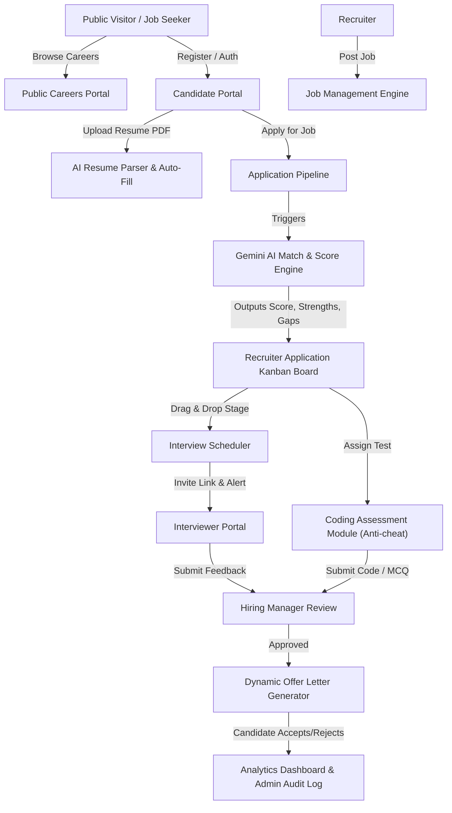

# Implementation Plan: AI-Powered Applicant Tracking System (ATS)

**Hackathon Event:** DevFusion 4.O  
**Problem Statement 2:** AI-Powered Recruitment & Applicant Tracking System (ATS)  
**Domain:** HRTech • AI • SaaS • Enterprise  
**Target Execution Window:** 24–48 Hours (2-Day Incremental Phase Build with 25 Human-like Commits)

---

## 1. Executive Summary & Problem Analysis

Recruitment today is plagued by manual resume screening, inefficient communication, disjointed scheduling, and lack of structured analytics. This project delivers a **production-ready, enterprise-grade AI-Powered ATS SaaS** built on Next.js 14 App Router, TypeScript, Tailwind CSS, Prisma (MongoDB/PostgreSQL), and Google Gemini AI.

### Core Workflow Ecosystem

---

## 2. Tech Stack & Architecture

| Layer | Technology | Purpose / Notes |
| :--- | :--- | :--- |
| **Frontend Framework** | **Next.js 14 (App Router)** | Server Components, API routes, fast SSR & client interaction |
| **Language** | **TypeScript** | Strict type-safety across client, API, and DB models |
| **Styling & UI** | **Tailwind CSS + Lucide Icons + Framer Motion** | Glassmorphism, dark/light modes, micro-animations |
| **Database & ORM** | **MongoDB / PostgreSQL + Prisma ORM** | Enterprise relational & JSON document schema |
| **AI Integration** | **Google Gemini 1.5 Flash API** | Resume parsing, JD candidate scoring, question generation |
| **Parsing & Files** | **pdf-parse / mammoth** | Extract raw text from PDF & DOCX resumes (up to 10MB) |
| **Editor / Assessment**| **Monaco / CodeMirror React** | In-browser code editor for technical coding tests |
| **Auth & Security** | **JWT + NextAuth / Custom Auth + bcrypt** | RBAC across 5 distinct user roles |
| **Deployment** | **Docker + Vercel / Railway** | Portable dockerized deployment with `.env.example` |

---

## 3. Mandatory User Roles & Access Matrix (RBAC)

1. **Candidate:** Create profile, upload resume, search/filter jobs, apply, track status, take coding tests, accept/reject offers.
2. **Recruiter:** Post/manage jobs, view applications, drag-and-drop Kanban, run AI match, schedule interviews, generate offer letters.
3. **Interviewer:** View assigned interviews, score candidate (Tech, Comm, Problem-Solving), submit feedback.
4. **Hiring Manager:** Review shortlisted candidates & interview feedback, approve/reject hiring decisions, view department analytics.
5. **Admin:** Manage users, role permissions, companies, jobs, platform settings, view audit logs.

---

## 4. Phase-by-Phase Execution & 25 GitHub Commit Roadmap

To simulate authentic, high-quality human development over 2 days while satisfying the **20-30 commit history requirement**, code will be committed step-by-step in logical, modular increments.

### **DAY 1: Core Architecture, Database, Authentication & Core Portals (Commits 1 - 13)**

#### **Phase 1: Project Setup & Database Foundations**
- [ ] **Commit 1:** `feat: initial project setup with Next.js 14, TypeScript, TailwindCSS and directory structure`
  - Setup Next.js App Router, Tailwind configuration, global CSS with dark mode support.
- [ ] **Commit 2:** `chore: configure database schema with Prisma (User, Job, Candidate, Application models)`
  - Create complete `schema.prisma` with User, Company, Job, Application, Resume, Interview, Assessment, OfferLetter, AuditLog models.
- [ ] **Commit 3:** `feat(auth): implement JWT authentication utilities and bcrypt password hashing`
  - Create standard password hashing (`lib/auth.ts`) and token handling utilities.

#### **Phase 2: Auth APIs & Responsive Landing Page**
- [ ] **Commit 4:** `feat(auth): create register, login, and forgot password API routes`
  - Implement API endpoints `/api/auth/register`, `/api/auth/login`, and `/api/auth/forgot-password`.
- [ ] **Commit 5:** `feat(ui): add layout, dark mode toggle, Navbar, and Footer components`
  - Reusable layout elements with theme toggle.
- [ ] **Commit 6:** `feat(landing): build responsive Landing Page with Hero, Features, Pricing, and Testimonials`
  - High-aesthetic conversion landing page with CTA for candidates and recruiters.
- [ ] **Commit 7:** `feat(auth-ui): build login and registration UI forms with client-side validation`
  - Interactive Auth modals/pages with role selector (Candidate vs Recruiter).

#### **Phase 3: Job Management & Public Careers Engine**
- [ ] **Commit 8:** `feat(jobs): implement Job creation and management backend API endpoints`
  - CRUD operations for jobs with skills array, experience level, salary range, and work mode filters.
- [ ] **Commit 9:** `feat(jobs): build Recruiter Job Management UI dashboard and posting wizard`
  - UI forms for recruiters to post, edit, close, and duplicate job postings.
- [ ] **Commit 10:** `feat(public): build public Careers job search page with filtering by location, type, and skills`
  - Searchable careers portal with instant filters and job detail modals.

#### **Phase 4: Candidate Profile & Resume Parsing Engine**
- [ ] **Commit 11:** `feat(candidate): build Candidate Profile creation and resume file upload route`
  - Profile fields, education, experience, portfolio links, and file upload dropzone (PDF/DOCX max 10MB).
- [ ] **Commit 12:** `feat(resume): integrate PDF/DOCX text extraction parser for uploaded resumes`
  - Text extraction pipeline using `pdf-parse`.
- [ ] **Commit 13:** `feat(ai): implement Google Gemini AI resume parsing service for skill and experience extraction`
  - Structured prompt to extract Name, Email, Phone, Skills, Education, Years of Exp, and auto-fill profile.

---

### **DAY 2: AI Matching, Kanban Pipeline, Assessments, Offers & Polish (Commits 14 - 25)**

#### **Phase 5: AI Resume Matching & Interactive Application Pipeline**
- [ ] **Commit 14:** `feat(ai): implement AI Job-Resume Matching algorithm with score, strengths, and gap analysis`
  - Gemini AI endpoint returning match %, missing skills list, strengths, and recommendation.
- [ ] **Commit 15:** `feat(kanban): build drag-and-drop Candidate Application Kanban pipeline board`
  - Stages: Applied -> Screening -> Shortlisted -> Technical Interview -> HR Interview -> Offer -> Hired/Rejected.
- [ ] **Commit 16:** `feat(kanban): add status progression API update handler for candidate application stages`
  - API patch route updating stage in real-time.

#### **Phase 6: Interview Scheduler & Interviewer Feedback System**
- [ ] **Commit 17:** `feat(interviews): implement Interview Scheduler backend & Google Meet link generator`
  - Schedule endpoint linking candidate, recruiter, interviewer, date/time, meeting URL.
- [ ] **Commit 18:** `feat(interviews): build Recruiter & Candidate interview calendar view and invitation UI`
  - Interactive schedule dashboard.
- [ ] **Commit 19:** `feat(feedback): add Interviewer scoring and structured feedback modal component`
  - Form evaluating Technical Skills, Communication, Problem Solving with composite rating.

#### **Phase 7: Coding Assessment & Anti-Cheat Module**
- [ ] **Commit 20:** `feat(assessment): build Coding Assessment engine with CodeMirror editor and timer`
  - Test environment supporting MCQs, SQL, and coding tasks with live timer.
- [ ] **Commit 21:** `feat(assessment): add tab-switch detection anti-cheat and automatic submission logic`
  - Security tracking tab switches, warning user, auto-submitting on timer expiration.

#### **Phase 8: Offer Letter Generator & Candidate Portal**
- [ ] **Commit 22:** `feat(offers): implement dynamic PDF Offer Letter Generator and candidate acceptance portal`
  - Dynamic offer letter creation from templates. Candidate can accept, reject, or download PDF.

#### **Phase 9: Analytics Dashboard, Admin Controls & Final Package**
- [ ] **Commit 23:** `feat(analytics): build Recruiter & Admin Analytics dashboard charts (funnel, time-to-hire)`
  - Visual charts for applicant conversion rate, time-to-hire, offer acceptance rate.
- [ ] **Commit 24:** `feat(admin): build Admin Control Panel for user role management and audit logs`
  - Full system management and security audit trail.
- [ ] **Commit 25:** `docs & devops: add OpenAPI swagger spec, Dockerfile, docker-compose, and comprehensive README`
  - Deployment-ready container setup, API docs, seed credentials, demo instructions.

---

## 5. Verification Plan

### Automated Verification
1. **TypeScript Build & Lint Check:**
   - Execute `npm run build` or `npx tsc --noEmit` to ensure zero compilation errors.
2. **API Verification:**
   - Test authentication, candidate application, AI parsing, and matching routes with test payloads.

### Manual Verification & Demo
1. **Role Access Testing:** Log in as Candidate, Recruiter, Interviewer, Hiring Manager, Admin to confirm permissions.
2. **AI Resume Matching:** Upload sample resume PDF and test matching score generation against a test Job Description.
3. **Kanban & Flow:** Drag applicant across stages and observe state transitions.
4. **Assessment & Offer Flow:** Take coding assessment, trigger offer letter, accept offer as candidate.

---

## 6. User Instructions for GitHub Commits

After each phase/stage of code generation:
1. Initialize git repo if not already created: `git init`
2. Staging changes: `git add .`
3. Commit with provided commit message: `git commit -m "feat(...): description"`
4. Push to remote: `git push origin main`

This guarantees a **clean, impressive git history with 25+ granular commits** over the 2-day timeline.
